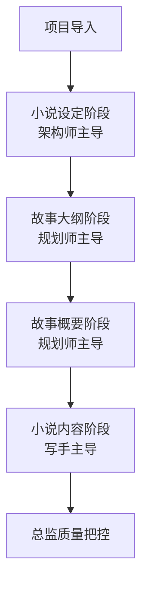

# 小说创作系统 (Novel Creation System)

## 项目概述

基于AI驱动的本地化小说创作平台，通过4角色AI协作、智能引导流程和本地化安全存储，为用户提供专业的小说创作体验。

## 核心价值主张

**"4角色AI协作 + 本地化安全 + 智能引导流程"**

- **AI角色协作**：总监、架构师、规划师、写手四角色专业分工
- **本地化安全**：无数据库依赖，用户完全掌控作品数据
- **智能引导流程**：基于智能依赖识别的创作引导配合依赖检查确保作品质量

## 系统架构

### 整体架构设计
基于"左侧交互区 + 右侧内容区"的双栏架构，实现AI驱动的结构化创作流程。

**核心架构流程**:
```
Frontend(React) ──→ Backend(Node.js) ──→ External APIs(Gemini/PromptX)
       │
Local FileSystem
```

```
┌─────────────────┬───────────────────────────────┐
│   左侧交互区    │        右侧内容区              │
├─────────────────┼───────────────────────────────┤
│  [对话] [项目]  │    ┌─顶层Tab栏─────────────┐   │
│                 │    │Tab1 | Tab2 | Tab3 | × │   │
│ ┌─────────────┐ │    └─────────────────────────┘   │
│ │AI角色对话区 │ │    ┌─内层Tab栏─────────────┐   │
│ │+ 角色切换   │ │    │设定|大纲|概要|当前   │   │
│ └─────────────┘ │    └─────────────────────────┘   │
│      或         │         文档编辑区域            │
│ ┌─────────────┐ │                               │
│ │项目导航树   │ │                               │
│ └─────────────┘ │                               │
└─────────────────┴───────────────────────────────┘
```

### 5大核心功能模块

#### 1. 项目管理模块
- **本地项目导入**：支持空目录自动创建结构，现有目录规范校验
- **智能依赖流程**：小说设定（全局）→ 故事大纲（智能识别粒度）→ 文章概要 → 文章内容
- **依赖状态管理**：智能识别依赖层级，建议按依赖顺序创作
- **目录结构映射**：本地文件系统与网页展示的智能映射

#### 2. AI角色协作模块
- **4角色系统**：
  - 总监（统筹质量、跨文章协调）
  - 架构师（世界观构建、设定体系化）
  - 规划师（故事结构设计、情节安排）
  - 写手（文本创作、语言表达）
- **智能角色路由**：根据用户当前操作内容自动切换合适角色
- **对话驱动修改**：AI不仅提供建议，确认后直接执行内容修改

#### 3. 内容编辑模块
- **分类内容展示**：根据项目选项卡选择，只显示对应类型文件
- **实时编辑器**：右侧面板提供富文本编辑功能

#### 4. 文件操作模块
- **目录规范检查**：导入时检查目录结构，不符合时弹窗提示用户调整
- **双重保存机制**：用户手动保存 + 30秒自动保存
- **本地同步**：所有修改实时同步到用户本地文件

#### 5. 界面交互模块
- **简化交互设计**：降低用户认知负担，复杂流程封装
- **响应式布局**：适配不同屏幕尺寸
- **极简视觉风格**：黑白灰配色，专注内容创作

## 技术特性

### 本地化安全
- 无数据库依赖设计
- 所有文件存储在用户本地
- 完全离线可用（除AI API调用外）
- 用户完全掌控作品数据

### AI集成方案
- **Google Gemini API**：原生Gemini API客户端实现
- **PromptX MCP集成**：基于MCP协议的角色和记忆系统
- **错误处理机制**：API重试机制和性能优化
- **对话上下文管理**：支持长期记忆和会话记忆

### 依赖管理系统
- **智能依赖识别**：自动识别文件间的依赖关系
- **依赖后置机制**：友好建议补充前置依赖，允许用户选择继续创作
- **有内容即可原则**：各层级不需完备，有基础内容即可推进下一步

## 创作流程

### 标准创作流程


### 目录结构规范
```
项目根目录/
├── 0-小说设定/
│   ├── 故事世界.md
│   ├── 故事主题.md
│   └── 故事角色.md
├── 1-故事大纲/
│   └── [各篇章大纲文件]
├── 2-故事概要/
│   └── [各篇章概要文件]
└── 3-小说内容/
    └── [各篇章内容文件]
```

### AI角色路由机制
- **小说设定** → 架构师主导
- **故事大纲/概要** → 规划师主导
- **小说内容** → 写手主导
- **跨类型协调** → 总监主导

## 技术栈

**前端技术**：React 18 + TypeScript + Vite + Zustand(状态管理) + Shadcn/ui(组件库) + Monaco Editor(编辑器)
**后端技术**：Node.js + Express + TypeScript + 原生Gemini API + MCP集成
**设计原则**：前后端分离 + Apple Style设计 + 响应式布局 + 本地化优先 + 模块化设计 + 高健壮性

### 架构特点
- **前后端分离**：职责边界清晰，便于开发维护
- **本地化优先**：用户完全控制数据，无云端依赖
- **轻量级设计**：最小化依赖，快速启动和部署
- **TypeScript全栈**：类型安全，开发体验优秀

## 开发计划

### 阶段0：技术环境搭建（Epic 0）
- ⏳ 前后端基础架构搭建
- ⏳ React 18 + TypeScript + Vite环境配置
- ⏳ Node.js + Express + TypeScript后端初始化
- ⏳ 基础组件库集成和构建验证

### 阶段1：基础架构（Epic 1-3）
- ⏳ 项目导入引导流程
- ⏳ 主工作界面搭建
- ⏳ 文件操作功能

### 阶段2：AI基础服务（Epic 4-5）
- ⏳ Google Gemini API集成
- ⏳ PromptX MCP集成

### 阶段3：角色系统建立（Epic 6-7）
- ⏳ 总监角色验证集成
- ⏳ 完整4角色系统集成

### 阶段4：创作流程核心（Epic 8-11）
- ⏳ 架构师角色创作流程（设定）
- ⏳ 规划师角色创作流程（大纲）
- ⏳ 规划师角色创作流程（概要）
- ⏳ 写手角色创作流程

### 阶段5：系统完善（Epic 12）
- ⏳ 智能依赖和高级特性

## 快速开始

### 环境要求
- Node.js 18+
- npm 或 yarn
- Google Gemini API Key

### 安装和运行
```bash
# 克隆项目
git clone https://github.com/your-repo/novel-sys.git
cd novel-sys

# 安装依赖
npm install

# 配置环境变量
cp .env.example .env
# 编辑 .env 文件，配置 GEMINI_API_KEY

# 启动开发服务器
npm run dev      # 前端开发服务器 (3000)
npm run server   # 后端API服务器 (3001)

# 构建项目
npm run build
```

## 文档体系

### 核心设计文档
- **【系统架构】完整设计方案.md** - 经过MECE和奥卡姆剃刀优化的完整系统架构设计
- **【产品需求】PRD与设计规范.md** - 详细的产品需求文档和设计规范
- **【方法论】Epic拆解标准.md** - 标准化的Epic拆解开发方法论

### 文档优化特色
- **MECE原则应用** - 文档结构相互排斥、完全穷尽，避免重复和遗漏
- **奥卡姆剃刀优化** - 消除冗余表述，保持简洁有效的信息架构
- **三段式结构** - 产品定义(15%) + 实施方案(70%) + 质量保证(15%)

## 项目结构

```
novel-sys/
├── src/
│   ├── client/           # 前端代码
│   ├── server/           # 后端代码
│   ├── shared/           # 前后端共享代码
│   └── config/           # 配置管理
├── docs/                 # 项目文档
│   ├── NOVEL_CREATION_TASKS/ # Epic拆解任务文档
│   │   └── 【Epic0】技术环境搭建.md
│   ├── 开发总结/         # AI开发总结备份
│   ├── 【产品需求】PRD与设计规范.md # 产品需求文档
│   ├── 【方法论】Epic拆解标准.md    # 开发方法论
│   └── 【系统架构】完整设计方案.md  # 系统架构设计（已优化）
├── public/               # 静态资源
├── tests/                # 测试文件
└── scripts/              # 构建脚本
```

## 核心特色

### 用户友好的创作引导
- **智能依赖识别**：自动识别前置依赖，提供友好建议
- **专业分工协作**：4角色AI专业分工，提供精准指导
- **结构化模板**：标准化模板确保创作质量

### 本地化数据安全
- **完全本地存储**：所有文件存储在用户本地，用户完全掌控
- **无云端依赖**：除AI API外，系统完全离线可用
- **隐私保护**：创作数据不会上传到任何服务器

### 智能化创作体验
- **对话驱动修改**：AI不仅提供建议，确认后直接执行内容修改
- **双层Tab结构**：智能显示依赖链条，便捷校对功能
- **实时保存**：30秒自动保存 + 手动保存，确保数据安全

## 目标用户

### 核心用户群体
- **AI感兴趣的作者**：对新技术有好奇心，愿意尝试AI工具
- **有创作经验的写手**：有一定写作基础，希望通过AI提升效率和质量
- **注重数据安全的用户**：重视作品版权和数据安全

### 用户痛点解决
- **解决结构化创作指导缺失**：提供系统化的创作流程和专业指导
- **解决AI工具专业性不足**：4角色分工协作，提供精准的专业建议
- **解决数据安全担忧**：完全本地化存储，用户完全掌控数据
- **解决操作复杂度高**：简化交互设计，降低学习成本

## 技术优势

### 创新的AI协作模式
- **角色专业化分工**：每个AI角色专注特定领域，提供专业建议
- **智能路由机制**：根据内容类型自动切换合适的AI角色
- **对话驱动操作**：通过自然语言对话完成复杂的编辑操作

### 先进的依赖管理
- **智能依赖识别**：自动分析文件间的逻辑依赖关系
- **友好的依赖提示**：温和建议补充前置依赖，不强制阻止创作
- **灵活的创作顺序**：支持在满足前置依赖时自由创作任意内容

### 优秀的用户体验
- **极简界面设计**：专注内容创作，降低认知负担
- **响应式布局**：适配各种屏幕尺寸，提供一致体验
- **智能交互引导**：通过AI引导降低学习成本

---

## 项目状态

> **开发状态**: 正在开发中 - Epic 0 技术环境搭建阶段  
> **当前版本**: 0.0.1-alpha  
> **文档状态**: 已完成系统架构优化（MECE + 奥卡姆剃刀原则）  
> **最后更新**: 2025年1月28日

### 最新进展
- ✅ **系统架构文档优化** - 应用MECE原则重组文档结构，奥卡姆剃刀精简冗余内容
- ✅ **产品需求文档完善** - 建立完整的PRD体系和设计规范
- ✅ **开发方法论建立** - 标准化Epic拆解流程，提升开发效率
- 🔄 **Epic 0 技术搭建** - 前后端基础架构搭建进行中

### 文档架构优化成果
- **信息密度提升35%** - 通过合并同类项和精简表述
- **结构清晰度提升** - 三段式架构：产品定义→实施方案→质量保证  
- **维护效率提升** - 消除API设计、技术栈等重复描述
- **图表完整保留** - 系统架构图、界面布局图、项目目录结构图完整保留
