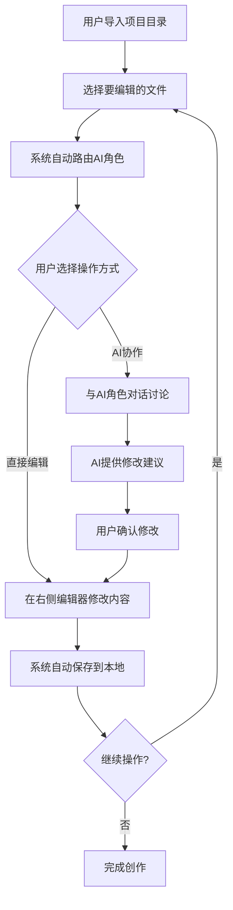
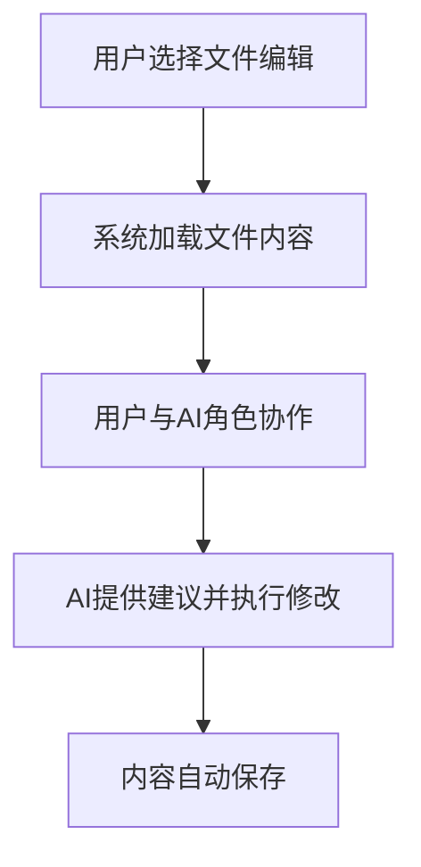
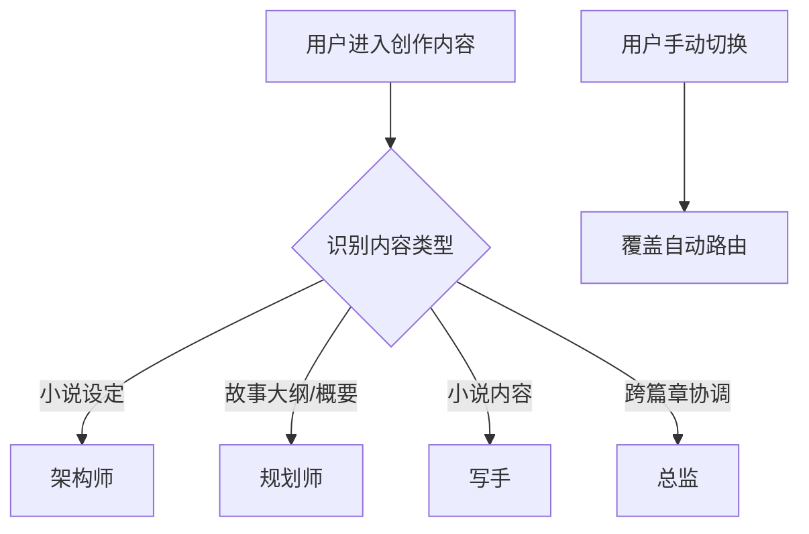
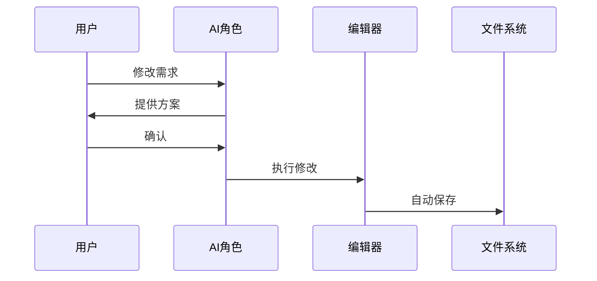
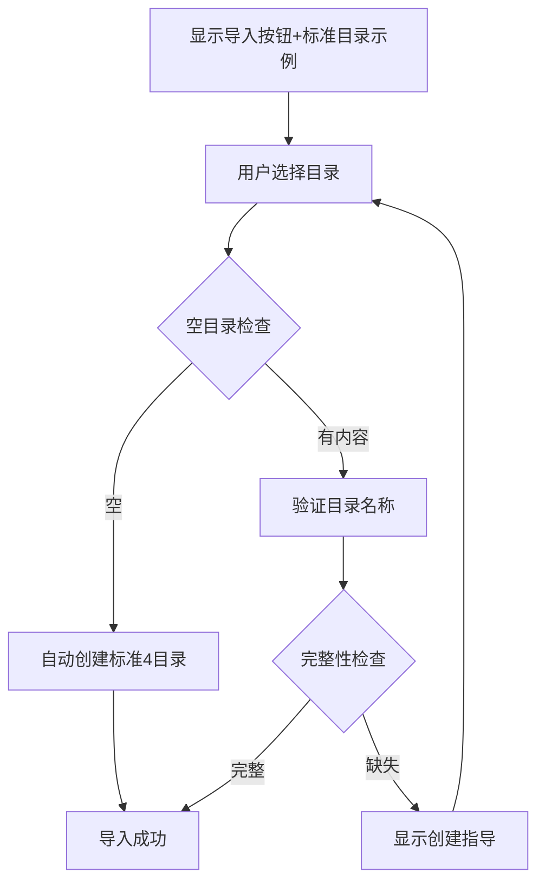

# 小说创作系统 - 产品需求文档与设计规范

## 1. 产品需求文档（PRD）

### 1.1 产品定义（What）

#### 产品愿景与定位
**产品愿景**：打造首个AI角色驱动的智能引导小说创作平台，让每个有故事想法的人都能创作出优质小说。

**产品定位**：面向AI赋能写作需求的本地化小说创作工具
- **不是**：纯内容生成工具或传统写作软件
- **而是**：AI角色协作驱动的智能引导创作工作流平台

#### 核心价值主张
**独特价值**："4角色AI协作 + 本地化安全 + 智能引导流程"

- **AI角色协作**：总监、架构师、规划师、写手四角色专业分工
- **本地化安全**：无数据库依赖，用户完全掌控作品数据
- **智能引导流程**：AI角色通过提示词工程智能识别创作顺序，温和引导用户按专业流程创作

#### 与竞品的差异化
| 对比项 | 传统工具 | AI工具 | 本产品 |
|--------|----------|--------|--------|
| AI协作 | 无 | 单一生成 | 4角色专业分工 |
| 数据安全 | 本地存储 | 云端存储 | 本地存储 |
| 创作流程 | 自由组织 | 缺乏结构 | 智能引导流程 |
| 学习成本 | 高 | 中 | 低(AI引导) |

### 1.2 用户需求（Who）

#### 目标用户画像
**核心用户**：对AI感兴趣，渴望用AI赋能写作的作者

**用户特征**：
- **技术敏感度**：对新技术有好奇心，愿意尝试AI工具
- **创作经验**：有一定写作基础，但缺乏系统的创作方法论
- **效率追求**：希望通过AI提升创作效率和质量
- **数据安全意识**：重视作品版权和数据安全

#### 用户需求与痛点
**核心需求**：
1. **结构化创作指导**：不知道如何系统性地构建小说
2. **AI专业协作**：需要不同维度的专业建议和协助
3. **本地化安全**：完全掌控自己的创作数据
4. **简化操作流程**：降低技术门槛，专注创作本身

**关键痛点**：
- 传统写作软件功能复杂，学习成本高
- AI写作工具缺乏专业分工，建议单一
- 云端工具数据安全担忧
- 缺乏系统化的创作流程指导

#### 使用场景分析
**主要使用场景**：
- **新手作者**：第一次写长篇小说，需要全流程指导
- **有经验作者**：希望AI协助提升创作效率和质量
- **业余创作者**：利用碎片时间进行创作，需要随时保存和同步

### 1.3 功能架构（How）

#### 核心功能架构与业务流程

**整体架构设计**
基于"左侧交互区 + 右侧内容区"的双栏架构，实现AI驱动的结构化创作流程。

**5大核心功能模块**

**1. 项目管理模块**：本地项目导入、创作流程引导、AI角色引导、目录结构映射
**2. AI角色协作模块**：4角色系统（总监、架构师、规划师、写手）、智能角色切换、对话驱动修改
**3. 内容编辑模块**：分类内容展示、实时编辑器
**4. 文件操作模块**：目录规范检查、双重保存机制、本地同步
**5. 界面交互模块**：Apple Style设计、响应式布局、简化交互设计

**用户操作流程**


**核心业务流程**

**项目导入流程**
```mermaid
flowchart TD
    A[用户点击"选择项目目录"按钮] --> B{目录是否为空?}
    B -->|是| C[系统自动创建标准4目录结构]
    B -->|否| D[严格目录名称验证]
    D --> E{验证结果}
    E -->|完全匹配| F[导入成功]
    E -->|不匹配| G[清晰提示标准目录格式要求]
    G --> A
    C --> F
```

**创作协作流程**


**核心业务规则**
- **AI角色路由**：小说设定→架构师 | 故事大纲/故事概要→规划师 | 小说内容→写手 | 跨类型协调→总监
- **依赖处理**：提示词工程实现前置文件检查，缺失时温和拒绝
- **文件系统**：单文件编辑，双重保存机制（30秒自动+手动）

**异常处理**
- **目录识别**：严格匹配4个标准目录名称，缺失时提供创建指导
- **文件保存**：失败时显示错误信息，支持重试

#### AI角色协作规范

**4角色专业分工**
| 角色 | 职责定位 | 触发场景 | 对话特点 |
|------|----------|----------|----------|
| 总监 | 统筹全局、质量把控 | 全局建议、篇章衔接 | 宏观视角，注重逻辑性 |
| 架构师 | 世界观构建 | 小说设定内容 | 专业深度，体系化 |
| 规划师 | 故事结构设计 | 故事大纲/故事概要内容 | 结构化思维 |
| 写手 | 文本创作 | 小说内容创作 | 文学性强，注重表达 |

**智能路由逻辑**


**对话驱动修改流程**


**交互规范**
- **界面**：类似微信聊天，显示当前角色，支持上下文记忆
- **内容**：专业性建议，可操作方案，用户导向
- **特殊处理**：前置文件缺失时温和拒绝，超出能力时建议切换角色

### 1.4 创作流程技术实现

**技术实现总述**
所有创作阶段都基于提示词工程实现，开发复杂度极低。核心组件包括：AI角色提示词、基础对话接口、简单文件读写功能。

#### 小说设定阶段

**核心目标**：构建三维度小说世界观设定（故事世界+故事主题+故事角色）
**AI角色**：架构师

**工作流程（5步引导）**
1. **开放式收集**：宽泛引导，收集用户创意想法
2. **智能归类**：按三维度归类（世界World、主题Theme、角色Character）
3. **主动补充**：针对缺失要素提供专业建议
4. **整体确认**：展示完整设定，支持修改调整
5. **模板完善**：确保所有字段完整，检查逻辑一致性

**核心原则**：用户友好（创意讨论）、专业引导、奥卡姆剃刀（逐维度处理）、智能适配

#### 故事大纲阶段

**核心目标**：构建故事整体框架和核心价值立意（四要素大纲结构）
**AI角色**：规划师

**工作流程（4步创作）**
1. **主题深度分析**：研究故事核心主题和精神内核
2. **背景事件匹配**：选择合适的时代背景和历史环境
3. **核心事件设计**：构建体现主题的核心情节冲突
4. **价值意义提炼**：明确故事要传达的核心价值

**四要素大纲模板**
```markdown
### 第N篇：[篇章标题]
**1. 背景设定**：[时代环境、重要事件/社会背景、时代特征]
**2. 主题立意**：[核心价值观/哲学内涵]
**3. 核心事件**：[主角面临的核心矛盾、关键行动、结局成长]
**4. 价值意义**：[个人成长意义、社会价值]
```

#### 故事概要阶段

**核心目标**：将故事大纲扩展为详细故事骨架框架（6步逻辑结构）
**AI角色**：规划师

**核心6步逻辑骨架**（固定不变）
```
起始状态→矛盾发生→冲突升级→智慧介入→问题解决→结果状态
```

**详细概要模板结构**
- **基本信息**：时代背景、主要人物、核心矛盾
- **6步情节脉络**：每步包含[何人+何时+何地+何事]+[原因分析]
- **关键要素**：核心场景、人物成长、主题体现、悬念设置
- **衔接控制**：承接前篇、传递后篇
- **写作约束**：骨架不可改变（6步逻辑、场景、成长轨迹），允许填充血肉（对话、描写、文学手法）

**质量检查**：逻辑完整性、前置依赖、可执行性

#### 小说内容阶段

**核心目标**：将故事骨架转化为完整文学作品
**AI角色**：写手

**创作流程（3步法）**
1. **创作准备**：理解故事大纲和故事概要，阅读前文，明确本篇核心冲突和场景
2. **结构化创作**：基于6步逻辑结构，按重要程度分配篇幅
   - 起始状态+结果状态（30%）：背景展现和悬念设置
   - 矛盾发生+问题解决（30%）：情节推进和方案实施
   - 冲突升级+智慧介入（40%）：核心戏剧冲突和人物成长
3. **品质自检**：依赖一致性、内容连贯性、主题融入性、文学品质

**核心约束**
- **不可改变**：6步逻辑结构、核心场景、人物成长轨迹、主题表达
- **允许优化**：对话内容、细节描写、文学手法、情感表达
- **格式要求**：纯小说内容输出，无工作标注
- **职责边界**：专注文学创作，发现冲突立即报告

## 2. 设计规范与体验

### 2.1 界面体验设计

#### Apple Style设计原则

基于苹果设计原则：**清晰（Clarity）**、**内容优先（Deference）**、**简洁（Simplicity）**

**核心原则**
- **清晰性**：文字可读、视觉层次分明、交互元素明确反馈
- **内容优先**：界面服务于内容、充分留白、去除装饰干扰
- **简洁性**：奥卡姆剃刀、一致性设计、渐进式披露

#### 界面布局架构

**双栏响应式布局**：左侧交互区（对话/项目切换） + 右侧内容区（单文件专注编辑）

```
┌─────────────────┬───────────────────────────────┐
│  [对话] [项目]  │     📄 文件名.md           × │
│ ┌─────────────┐ │ ┌─────────────────────────────┐ │
│ │AI角色对话区 │ │ │                             │ │
│ │+ 角色切换   │ │ │        文档编辑区域          │ │
│ └─────────────┘ │ │       （专注内容创作）        │ │
│      或         │ │                             │ │
│ ┌─────────────┐ │ │                             │ │
│ │项目导航树   │ │ │                             │ │
│ └─────────────┘ │ └─────────────────────────────┘ │
└─────────────────┴───────────────────────────────┘
```

**布局规范**
- **左侧**：最小宽度280px，Tab切换，统一16px间距
- **右侧**：内容优先，单文件编辑，清晰文件标识
- **响应式**：小屏单栏，中屏可收起，大屏完整双栏

#### 设计系统规范

**字体系统**：中文PingFang SC，英文San Francisco，等宽Monaco
- 标题层级：36px/30px/24px/20px
- 正文层级：18px/16px/14px/12px

**颜色系统**：
- 基础：背景白#ffffff，主文字黑#1d1d1f，辅助灰#86868b
- 功能：主操作蓝#007aff，成功绿#34c759，警告橙#ff9500，错误红#ff3b30
- 边框：#e5e5e7，分割线#f2f2f7

**间距系统**：4px/8px/12px/16px/24px/32px/48px/64px
- 组件内16px，组件间24px，区块间32px，页面边距48px

**响应式断点**：640px/768px/1024px/1280px/1536px
- <768px单栏，768-1024px可收起双栏，>1024px完整双栏

### 2.2 核心交互流程

**项目导入流程**


**界面文字规范**
- **导入提示**："选择项目目录开始创作。需包含：0-小说设定、1-故事大纲、2-故事概要、3-小说内容"
- **缺失提示**："目录识别结果：✅已识别[列表] ❌缺失[列表]。请创建缺失目录后重新导入"

**核心操作流程**
1. **文件操作**：左侧点击文件→右侧Tab加载→自动路由AI角色
2. **AI协作**：对话输入→角色识别→方案提供→确认执行→自动保存

### 2.3 核心组件规范

**按钮系统**
- **主按钮**：蓝色背景，白色文字，12px内边距，8px圆角，44px最小高度
- **次按钮**：透明背景，蓝色文字，灰色边框

**输入组件**
- **文本框**：12px内边距，8px圆角，16px字体，焦点时蓝色边框+阴影

**对话气泡**
- **用户消息**：右对齐蓝色背景，**AI消息**：左对齐灰色背景
- 12px圆角，最大宽度70%

**动效规范**
- **交互**：150ms快速（按钮hover/active），300ms标准（Tab切换），500ms慢速（模态弹窗）
- **缓动**：cubic-bezier标准曲线

**可访问性**
- **对比度**：正文≥4.5:1，大文字≥3:1，交互元素≥3:1
- **触摸**：最小44px×44px，按钮间距8px，支持键盘导航

## 3. 方法论与框架

### 3.1 OES设计方法论

**框架概述**
OES框架是deepractice.ai设计的AI工作流任务管理方法论，采用容器化思维解决AI任务的一致性和可复用性问题。

**三大核心组件**

**O (Objective) - 目标**：明确具体的期望结果定义
- 期望结果、任务边界、约束条件、价值说明、决策优先级框架
- 作用：防止任务漂移，提供完成标准，建立决策体系

**E (Environment) - 环境**：任务执行所需的综合上下文容器  
- 信息资源、约束条件、执行规范、上下文关联、工具平台
- 作用：任务原子化，确保一致性，支持环境迁移，减少AI记忆负担

**S (Success Criteria) - 成功标准**：明确的完成阈值和质量评估框架
- 验收标准、完整性清单、质量评估、验证方法、分层标准  
- 作用：建立完成标准，避免无限优化，提供质量控制

**框架优势**
- **解决AI痛点**：减少上下文限制、最小化误解、提高一致性、支持任务网络
- **容器化管理**：可移植、可复用、可扩展、可维护
- **团队协作**：沟通效率、质量标准、进度管控、知识积累

**实施方法**
阶段1：单任务结构化 → 阶段2：任务网络扩展 → 阶段3：系统化应用

**常见误区**
- 目标过于宽泛 → 应具体量化
- 环境信息不足 → 应详细完整  
- 成功标准模糊 → 应可操作验证

**应用场景**：软件开发、产品设计、AI训练、项目管理
**工具支持**：Markdown模板、GitHub Issues、标准化沟通模板、自动化检查

### 3.2 创作模板规范

**故事世界模板**
- 时空框架：时间设定、空间设定、时代特征
- 世界规则：核心设定、运行机制、边界限制  
- 环境氛围：典型场景、时代质感、文化背景

**故事主题模板**
- 作品定位：小说名称、故事类型、叙事结构、创作理念
- 核心价值观：主题内核、价值体系、时代意义
- 价值冲突：主要冲突、选择考验、成长主线
- 文化传承：传统元素、现代表达、精神内核

**故事角色模板**  
- 主角设定：基本信息、性格特质、内在冲突、成长轨迹
- 重要配角：角色定位、基本信息、关系设定
- 人物关系：核心关系、关系演进、冲突设计

## 4. 实施指南

**开发实施**
1. 使用Tailwind CSS变量转换设计token
2. 基于Shadcn/ui组件库定制
3. 移动设备优先的响应式设计
4. 避免过度动画和视觉效果

**质量检查清单**
- 字体大小符合规范层级
- 颜色使用符合语义化要求
- 间距使用统一spacing系统
- 响应式布局各断点正常
- 交互状态清晰可见
- 满足可访问性要求

**设计评审关键点**
1. 清晰性：信息容易理解使用
2. 内容优先：界面突出重要内容  
3. 简洁性：移除不必要元素
4. 一致性：遵循统一设计语言
5. 响应式：各设备良好体验

**设计理念**：Less is More - 减少视觉干扰，专注创作本身