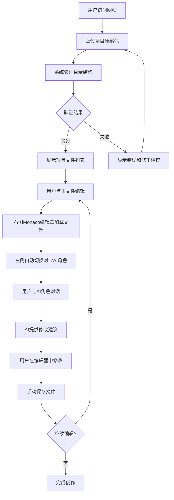

# 小说创作系统 MVP - 技术规格说明书

## 1. 项目概览

### 1.1 技术架构
```
用户浏览器(React SPA) ←→ Node.js后端API ←→ Gemini API (直接调用)
      ↑                           ↓
File System Access API     PromptLoader服务
      ↓                           ↓  
   本地文件系统              角色提示词文件

注：PromptX MCP集成作为后续扩展保留，当前使用直接API调用方式
```

### 1.2 核心技术栈
- **前端**: React 18 + TypeScript + Vite + Zustand + Shadcn/ui + Monaco Editor
- **后端**: Node.js + Express + TypeScript + MCP SDK
- **AI集成**: PromptX MCP + 用户自定义角色提示词
- **文件处理**: Multer (文件上传) + Node.js fs模块

## 2. 功能规格定义

### 2.1 核心功能范围

#### ✅ **MVP必须功能**
1. **项目文件上传**: 用户上传本地项目文件夹压缩包
2. **4目录结构验证**: 严格验证`0-小说设定/`、`1-故事大纲/`、`2-故事概要/`、`3-小说内容/`
3. **双栏界面**: 左侧AI对话区 + 右侧Monaco文件编辑器
4. **4角色AI对话**: 架构师、规划师、写手、总监（基于用户提供的提示词）
5. **自动角色路由**: 根据编辑文件类型自动切换对应角色
6. **手动角色切换**: 用户可主动选择任意角色
7. **文件编辑保存**: Monaco编辑器 + 手动保存到服务器

#### ❌ **MVP暂不包含**
- 30秒自动保存（手动保存优先）
- 多项目管理
- 文件导出功能
- 复杂记忆管理
- 其他AI模型支持

### 2.2 用户操作流程



## 3. 界面设计规格

### 3.1 响应式布局规范

```css
/* 布局断点 */
@media (max-width: 768px) {
  /* 移动端: 单栏布局，可切换显示 */
  .layout { flex-direction: column; }
}

@media (min-width: 769px) {
  /* 桌面端: 双栏布局 */
  .layout { 
    display: flex;
    height: 100vh;
  }
  .sidebar { width: 350px; min-width: 300px; }
  .main { flex: 1; }
}
```

### 3.2 双栏界面规格

#### **左侧交互区** (350px宽度)
- **顶部Tab切换**: "对话" | "项目文件"
- **对话Tab**:
  - AI角色指示器（当前角色名称 + 头像）
  - 聊天消息历史区域
  - 消息输入框 + 发送按钮
  - 手动角色切换下拉选择器
- **项目文件Tab**:
  - 项目上传区域
  - 4目录结构树形展示
  - 文件点击编辑功能

#### **右侧内容区** (剩余宽度)
- **文件标签栏**: 显示当前编辑的文件名 + 关闭按钮
- **Monaco编辑器**: 全屏文件编辑区域
- **底部状态栏**: 保存状态 + 手动保存按钮

### 3.3 UI组件规格

#### **文件上传组件**
```typescript
interface FileUploadProps {
  onUpload: (file: File) => Promise<void>;
  accept: '.zip,.rar,.7z';
  maxSize: 50 * 1024 * 1024; // 50MB
  multiple: false;
}
```

#### **AI对话组件**
```typescript
interface AIChatProps {
  currentRole: AIRole;
  messages: ChatMessage[];
  onSendMessage: (message: string) => void;
  onRoleChange: (role: AIRole) => void;
  isLoading: boolean;
}

interface ChatMessage {
  id: string;
  role: 'user' | 'assistant';
  content: string;
  timestamp: number;
  roleId?: string;
}
```

#### **Monaco编辑器组件**
```typescript
interface CodeEditorProps {
  value: string;
  onChange: (value: string) => void;
  language: 'markdown' | 'plaintext';
  readOnly: boolean;
  onSave: () => void;
  isDirty: boolean;
}
```

## 4. API接口规格

### 4.1 后端API端点

#### **项目管理接口**
```typescript
// POST /api/project/upload - 上传项目文件
interface UploadRequest {
  file: File; // 压缩包文件
}

interface UploadResponse {
  success: boolean;
  data: {
    projectId: string;
    structure: ProjectStructure;
  };
  error?: string;
}

// GET /api/project/:projectId/files - 获取项目文件列表
interface FilesResponse {
  success: boolean;
  data: {
    files: FileItem[];
    structure: FolderStructure;
  };
}

// GET /api/project/:projectId/file/:filePath - 读取文件内容
interface FileContentResponse {
  success: boolean;
  data: {
    content: string;
    lastModified: string;
  };
}

// PUT /api/project/:projectId/file/:filePath - 保存文件内容
interface SaveFileRequest {
  content: string;
}
```

#### **AI对话接口**
```typescript
// POST /api/ai/chat - 发送消息给AI角色
interface ChatRequest {
  projectId: string;
  roleId: 'architect' | 'planner' | 'writer' | 'director';
  message: string;
  context?: {
    currentFile?: string;
    fileType?: string;
  };
}

interface ChatResponse {
  success: boolean;
  data: {
    message: string;
    roleId: string;
    timestamp: string;
  };
}

// GET /api/ai/roles - 获取可用AI角色列表
interface RolesResponse {
  success: boolean;
  data: AIRole[];
}
```

### 4.2 PromptX MCP集成规格

#### **MCP服务器配置**
```json
{
  "servers": {
    "promptx": {
      "type": "stdio",
      "command": "npx",
      "args": ["@promptx/cli", "mcp-server"],
      "description": "PromptX AI角色服务器",
      "enabled": true
    }
  }
}
```

#### **角色激活调用**
```typescript
// 通过MCP客户端调用PromptX角色
const activateRole = async (roleId: string, message: string) => {
  const mcpClient = getMCPClient('promptx');
  
  // 1. 激活角色
  await mcpClient.callTool('action', { role: roleId });
  
  // 2. 发送消息
  const response = await mcpClient.callTool('chat', {
    message: message,
    role: roleId
  });
  
  return response;
};
```

## 5. 数据结构规格

### 5.1 项目数据结构

```typescript
interface ProjectStructure {
  id: string;
  name: string;
  uploadTime: string;
  structure: {
    '0-小说设定': FileItem[];
    '1-故事大纲': FileItem[];
    '2-故事概要': FileItem[];
    '3-小说内容': FileItem[];
  };
}

interface FileItem {
  name: string;
  path: string;
  size: number;
  lastModified: string;
  type: 'file' | 'folder';
  content?: string; // 文件内容（按需加载）
}
```

### 5.2 AI角色数据结构

```typescript
interface AIRole {
  id: 'architect' | 'planner' | 'writer' | 'director';
  name: string;
  description: string;
  promptTemplate: string; // 用户提供的提示词
  targetFileTypes: string[]; // 负责的文件类型
  color: string; // 界面显示颜色
  icon: string; // 角色图标
}

// 4角色路由映射
const ROLE_ROUTING = {
  '0-小说设定': 'architect',    // 架构师
  '1-故事大纲': 'planner',      // 规划师
  '2-故事概要': 'planner',      // 规划师
  '3-小说内容': 'writer'        // 写手
} as const;
```

## 6. 技术实现规格

### 6.1 前端状态管理

```typescript
// Zustand状态管理
interface AppState {
  // 项目状态
  currentProject: ProjectStructure | null;
  projectFiles: FileItem[];
  
  // 编辑状态  
  currentFile: FileItem | null;
  fileContent: string;
  isDirty: boolean;
  
  // AI对话状态
  currentRole: AIRole;
  chatMessages: ChatMessage[];
  isAILoading: boolean;
  
  // UI状态
  sidebarTab: 'chat' | 'files';
  isFileSelectorOpen: boolean;
  
  // Actions
  setProject: (project: ProjectStructure) => void;
  setCurrentFile: (file: FileItem) => void;
  updateFileContent: (content: string) => void;
  addChatMessage: (message: ChatMessage) => void;
  switchRole: (role: AIRole) => void;
  saveFile: () => Promise<void>;
}
```

### 6.2 关键业务逻辑

#### **自动角色路由逻辑**
```typescript
const getAutoRole = (filePath: string): AIRole => {
  if (filePath.includes('0-小说设定')) return 'architect';
  if (filePath.includes('1-故事大纲')) return 'planner';
  if (filePath.includes('2-故事概要')) return 'planner';  
  if (filePath.includes('3-小说内容')) return 'writer';
  return 'director'; // 默认总监
};

const handleFileSelect = (file: FileItem) => {
  const autoRole = getAutoRole(file.path);
  switchRole(autoRole);
  setCurrentFile(file);
  loadFileContent(file.path);
};
```

#### **目录结构验证逻辑**
```typescript
const validateProjectStructure = (files: FileItem[]): ValidationResult => {
  const requiredDirs = [
    '0-小说设定',
    '1-故事大纲', 
    '2-故事概要',
    '3-小说内容'
  ];
  
  const existingDirs = files
    .filter(f => f.type === 'folder')
    .map(f => f.name);
    
  const missingDirs = requiredDirs.filter(
    dir => !existingDirs.includes(dir)
  );
  
  return {
    isValid: missingDirs.length === 0,
    missingDirectories: missingDirs,
    suggestions: missingDirs.map(dir => 
      `请创建目录: ${dir}`
    )
  };
};
```

### 6.3 错误处理规格

#### **前端错误处理**
```typescript
// API调用错误处理
const apiCall = async (url: string, options: RequestInit) => {
  try {
    const response = await fetch(url, options);
    
    if (!response.ok) {
      throw new Error(`HTTP ${response.status}: ${response.statusText}`);
    }
    
    return await response.json();
  } catch (error) {
    console.error('API调用失败:', error);
    
    // 用户友好的错误提示
    if (error.message.includes('Failed to fetch')) {
      throw new Error('网络连接失败，请检查网络连接');
    }
    
    throw error;
  }
};
```

#### **后端错误处理**
```typescript
// 统一错误处理中间件
app.use((error: Error, req: Request, res: Response, next: NextFunction) => {
  console.error('服务器错误:', error);
  
  // MCP连接错误
  if (error.message.includes('MCP')) {
    return res.status(503).json({
      success: false,
      error: 'AI服务暂时不可用，请稍后重试'
    });
  }
  
  // 文件操作错误
  if (error.code === 'ENOENT') {
    return res.status(404).json({
      success: false,
      error: '文件不存在'
    });
  }
  
  // 默认错误
  res.status(500).json({
    success: false,
    error: '服务器内部错误'
  });
});
```

## 7. 性能优化规格

### 7.1 前端性能优化

#### **代码分割**
```typescript
// 路由级别懒加载
const ProjectEditor = lazy(() => import('./components/ProjectEditor'));
const FileUploader = lazy(() => import('./components/FileUploader'));

// Monaco编辑器按需加载
const MonacoEditor = lazy(() => 
  import('@monaco-editor/react').then(module => ({
    default: module.Editor
  }))
);
```

#### **状态优化**
```typescript
// 使用useMemo缓存昂贵计算
const processedFileTree = useMemo(() => {
  return buildFileTree(projectFiles);
}, [projectFiles]);

// 使用useCallback缓存函数引用
const handleFileSave = useCallback(async () => {
  await saveFileToServer(currentFile.path, fileContent);
  setIsDirty(false);
}, [currentFile, fileContent]);
```

### 7.2 后端性能优化

#### **文件缓存策略**
```typescript
// 内存缓存文件内容（小文件）
const fileCache = new Map<string, { content: string; timestamp: number }>();

const getCachedFileContent = (filePath: string) => {
  const cached = fileCache.get(filePath);
  const maxAge = 5 * 60 * 1000; // 5分钟
  
  if (cached && Date.now() - cached.timestamp < maxAge) {
    return cached.content;
  }
  
  return null;
};
```

#### **MCP连接池管理**
```typescript
// MCP客户端连接池
class MCPConnectionPool {
  private connections = new Map<string, MCPClient>();
  private maxConnections = 3;
  
  async getConnection(serverId: string): Promise<MCPClient> {
    if (this.connections.has(serverId)) {
      return this.connections.get(serverId)!;
    }
    
    if (this.connections.size >= this.maxConnections) {
      // 清理最旧的连接
      const oldestKey = this.connections.keys().next().value;
      await this.closeConnection(oldestKey);
    }
    
    const client = await this.createConnection(serverId);
    this.connections.set(serverId, client);
    return client;
  }
}
```

## 8. 安全规格

### 8.1 文件安全

```typescript
// 文件路径安全检查
const sanitizeFilePath = (filePath: string): string => {
  // 防止路径遍历攻击
  const normalized = path.normalize(filePath);
  
  if (normalized.includes('..') || normalized.startsWith('/')) {
    throw new Error('非法文件路径');
  }
  
  return normalized;
};

// 文件类型白名单
const ALLOWED_FILE_TYPES = ['.md', '.txt', '.json'];
const isAllowedFileType = (filename: string): boolean => {
  const ext = path.extname(filename).toLowerCase();
  return ALLOWED_FILE_TYPES.includes(ext);
};
```

### 8.2 输入验证

```typescript
// API输入验证中间件
const validateChatInput = (req: Request, res: Response, next: NextFunction) => {
  const { message, roleId } = req.body;
  
  if (!message || typeof message !== 'string') {
    return res.status(400).json({
      success: false,
      error: '消息内容不能为空'
    });
  }
  
  if (message.length > 4000) {
    return res.status(400).json({
      success: false,
      error: '消息长度不能超过4000字符'
    });
  }
  
  const validRoles = ['architect', 'planner', 'writer', 'director'];
  if (!validRoles.includes(roleId)) {
    return res.status(400).json({
      success: false,
      error: '无效的角色ID'
    });
  }
  
  next();
};
```

## 9. 测试规格

### 9.1 单元测试

#### **前端组件测试**
```typescript
// FileUploader组件测试
describe('FileUploader Component', () => {
  it('should upload valid zip file', async () => {
    const mockFile = new File(['test'], 'project.zip', { type: 'application/zip' });
    const mockOnUpload = jest.fn();
    
    render(<FileUploader onUpload={mockOnUpload} />);
    
    const input = screen.getByLabelText('上传项目文件');
    fireEvent.change(input, { target: { files: [mockFile] } });
    
    expect(mockOnUpload).toHaveBeenCalledWith(mockFile);
  });
  
  it('should reject invalid file types', () => {
    const mockFile = new File(['test'], 'project.exe', { type: 'application/exe' });
    
    render(<FileUploader onUpload={jest.fn()} />);
    
    const input = screen.getByLabelText('上传项目文件');
    fireEvent.change(input, { target: { files: [mockFile] } });
    
    expect(screen.getByText('不支持的文件类型')).toBeInTheDocument();
  });
});
```

#### **后端API测试**
```typescript
// 文件上传API测试
describe('POST /api/project/upload', () => {
  it('should upload and validate project structure', async () => {
    const response = await request(app)
      .post('/api/project/upload')
      .attach('file', './test/fixtures/valid-project.zip')
      .expect(200);
    
    expect(response.body.success).toBe(true);
    expect(response.body.data.projectId).toBeDefined();
    expect(response.body.data.structure).toHaveProperty('0-小说设定');
  });
  
  it('should reject invalid project structure', async () => {
    const response = await request(app)
      .post('/api/project/upload')
      .attach('file', './test/fixtures/invalid-project.zip')
      .expect(400);
    
    expect(response.body.success).toBe(false);
    expect(response.body.error).toContain('目录结构不符合要求');
  });
});
```

### 9.2 集成测试

#### **AI对话流程测试**
```typescript
describe('AI Chat Integration', () => {
  it('should complete full chat workflow', async () => {
    // 1. 上传项目
    const uploadResponse = await uploadTestProject();
    const projectId = uploadResponse.data.projectId;
    
    // 2. 选择文件（自动路由角色）
    const fileResponse = await selectFile(projectId, '0-小说设定/故事世界.md');
    expect(fileResponse.autoRole).toBe('architect');
    
    // 3. 发送消息给AI
    const chatResponse = await sendChatMessage({
      projectId,
      roleId: 'architect',
      message: '请帮我优化这个世界设定'
    });
    
    expect(chatResponse.success).toBe(true);
    expect(chatResponse.data.message).toBeDefined();
  });
});
```

### 9.3 E2E测试

```typescript
// Playwright E2E测试
test('完整小说创作工作流程', async ({ page }) => {
  // 1. 访问首页
  await page.goto('/');
  
  // 2. 上传项目文件
  const fileInput = page.locator('[data-testid="file-upload"]');
  await fileInput.setInputFiles('./test/fixtures/novel-project.zip');
  await expect(page.locator('.upload-success')).toBeVisible();
  
  // 3. 选择文件编辑
  await page.click('[data-testid="file-item-0-小说设定"]');
  await expect(page.locator('.monaco-editor')).toBeVisible();
  
  // 4. 验证角色自动切换
  const roleIndicator = page.locator('[data-testid="current-role"]');
  await expect(roleIndicator).toHaveText('架构师');
  
  // 5. AI对话交互
  await page.fill('[data-testid="chat-input"]', '请帮我分析这个设定');
  await page.click('[data-testid="send-button"]');
  await expect(page.locator('.ai-message')).toBeVisible();
  
  // 6. 文件编辑和保存
  const editor = page.locator('.monaco-editor textarea');
  await editor.fill('更新后的小说设定内容');
  await page.click('[data-testid="save-button"]');
  await expect(page.locator('.save-success')).toBeVisible();
});
```

## 10. 部署规格

### 10.1 开发环境

```bash
# 环境要求
Node.js >= 18.0.0
npm >= 8.0.0
PromptX CLI >= 1.10.0

# 安装依赖
npm install

# 启动开发服务器
npm run dev      # 前端开发服务器 (3000)
npm run server   # 后端API服务器 (3001)  

# PromptX MCP服务器
npx @promptx/cli mcp-server  # 手动启动测试
```

### 10.2 生产环境

```dockerfile
# Dockerfile
FROM node:18-alpine

WORKDIR /app

# 安装PromptX CLI
RUN npm install -g @promptx/cli

# 复制依赖文件
COPY package*.json ./
RUN npm ci --only=production

# 复制应用代码
COPY . .

# 构建前端
RUN npm run build

# 暴露端口
EXPOSE 3001

# 启动应用
CMD ["npm", "start"]
```

### 10.3 环境变量配置

```env
# .env.example
NODE_ENV=production
PORT=3001

# 文件存储
UPLOAD_DIR=./uploads
MAX_FILE_SIZE=52428800

# PromptX配置
PROMPTX_MCP_PORT=8080
PROMPTX_MCP_HOST=localhost

# 安全配置
JWT_SECRET=your-jwt-secret-here
CORS_ORIGINS=https://yourdomain.com

# 日志配置
LOG_LEVEL=info
```

---

## 总结

这份技术规格说明书定义了小说创作系统MVP的完整技术实现方案。基于前端优先的开发策略，我们可以快速搭建界面原型，然后逐步集成后端API和PromptX MCP功能。

**估计开发时间**: 5-7个工作日
**关键里程碑**: 
1. Day 1-2: 前端界面完成
2. Day 3: 后端基础API完成  
3. Day 4-5: PromptX MCP集成完成
4. Day 6-7: 功能整合和测试

您觉得这个技术规格方案如何？有需要调整或补充的地方吗？